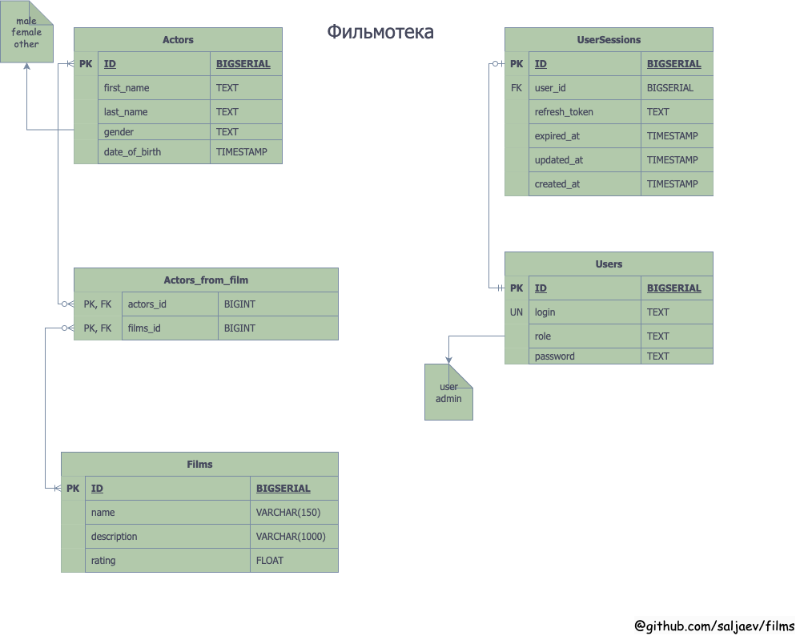

# Стажировка VK. Бэкенд приложение "Фильмотека"

## Содержание
- [Задание](#задание)
    - [Общие требования](#общие-требования)
- [Реализация](#реализация)
    - [Дизай базы данных](#дизайн-база-данных)
    - [Структура проекта](#структура-проекта)
    
___
### Задание
Написать бэкенд приложение, которое предоставляет REST API для управления базой данных фильмов.
Приложение должно содержать следующие функции:
- Актеры:
    - Добавление информации об актере
    - Обновление информации как частичное, так и полное
    - Удаление информации об актере
    - Получение списка актеров с фильмами, в которых он участвовал
- Фильмы:
    - Добавление информации об фильме
    - Обновление информации как частичное, так и полное
    - Удаление информации об фильме
    - Получение фильмов с возможностью сортировки по полю
    - Поиск фильма по фрагменту названия фильма или имени актера

Доступ к API должен быть закрыт авторизацией
Имеется разграничение ролей на пользователей и администраторов, пользователи могут только получать данные.

___
### Общие требования:
- Приложение реализовать на GO
- Логгирование только общей информации и ошибок
- Использание стандартного роутера (без фреймворка)
- Код приложения покрыт unit-тестами
- Dockerfile
- Docker-compose
___
## Реализация:
Приложение написано на [Чистой архитектуре](#https://github.com/evrone/go-clean-template) с использованием принципа [Standard Go Project Layout](#https://github.com/golang-standards/project-layout).
В своем приложение я использовал в качестве БД ```Postgres``` и стандартную библиотеку из go 1.22 ```slog``` для логгера.
<br><br> 
Для закрытия API использовал стандарт OAuth 2 вместе с JWT, а именно генерация refresh и access токенов, 
где refresh токен может единоразово обновить access токен. Пользователи имеют сессии и роли, которые также хранятся в БД
.Добавление администратора производится напрямую через БД.
<br><br>
Валидация данных происходит в `handlers`, при введение невалидных запросов будет выдаваться ответ с ошибкой. Подробнее 
об ошибках и запросах написано в документации к серверу. Документация написана с подходом ```code-first``` и расположена в `./docs/openapi.yaml`.
<br><br>
Обертки для роутера и для контекста написаны для повышения безопасности, изоляции и разделения на слои в соответствии с архитектурой приложения.

___
### Дизайн база данных


Пользователь может иметь только одну сессию или не иметь совсем, сессия же связана с одним и только одним пользователя.
<br>
Актер и фильмы связаны связью много ко много, поэтому создана связующая таблица с названием ```actors_from_films```
<br>
Поле ```role``` у пользователя имеет CONSTRAINT на значения ```user/admin```, поле ```gender``` у актера ```male/female/other```.
Запросы на удаление актера из фильма или удаление фильма происходит с использованием транзакций.
___
### Структура проекта
```

cmd
└── backend
    └── main.go <- Точка входа в приложение
config
└── config.yaml <- Конфигурация приложения
internal
├── api
│   ├── handlers
│   │   ├── actors
│   │   │   ├── tests <- Тесты для валидации запросов
│   │   │   └── ... <- Обработчики запросов с актерами
│   │   ├── films
│   │   │   ├── tests <- Тесты для валидации запросов
│   │   │   └── ... <- Обработчики запросов с фильмами
│   │   ├── middleware
│   │   │   └── ... <- Обработчики доступа к данным
│   │   └── users
│   │       ├── tests <- Тесты для валидации запросов
│   │       └── ... <- Обработчики запросов с  пользователями
│   └── utilapi
│       ├── context.go <- Контекст для обработчиков
│       └── router.go <- Роутер для обработчиков
├── app
│   └── app.go <- Код инициализации
├── config
│   └── config.go <- Код загрузки и получения данных с конфига
├── entities
│   ├── actorts.go <- Сущность актера
│   ├── films.go <- Сущность фильма
│   ├── user.go <- Сущность пользователя
│   └── user_session.go <- Сущность сессии пользователя
├── logger
│   └── ... <- Код логгера
├── migrations
│   └── ... <- Файлы миграций
├── models
│   ├── actorts.go <- Модель актера
│   ├── films.go <- Модель фильма
│   ├── user.go <- Модель пользователя
│   └── user_session.go <- Модель сессии пользователя
└── usecase
    ├── repo
    │   └── postgres
    │       └── ... <- Файлы для работы с postgres
    ├── actors.go <- Методы актеров
    ├── films.go <- Методы фильмов
    ├── interfaces.go <- Интерфейсы запросов
    ├── users.go <- Методы пользователей
    └── users_session.go <- Методы сессий пользователей
pkg
└── jwt_manager.go <- Работа с JWT токенами
Dockerfile
docker-compose
.env <- Переменные окружения для docker
```
___
### Тесты
Для проверки большей части функционала сервера нужно использовать docker-compose и приложение для взаимодействий с БД.

Алгоритм:
1. Зарегестрировать пользователя
2. Изменить роль пользователя на `admin` напряммую запросом через БД
3. Или сразу создать пользователя с ролью `admin` через БД (первые два тогда можно пропустить)